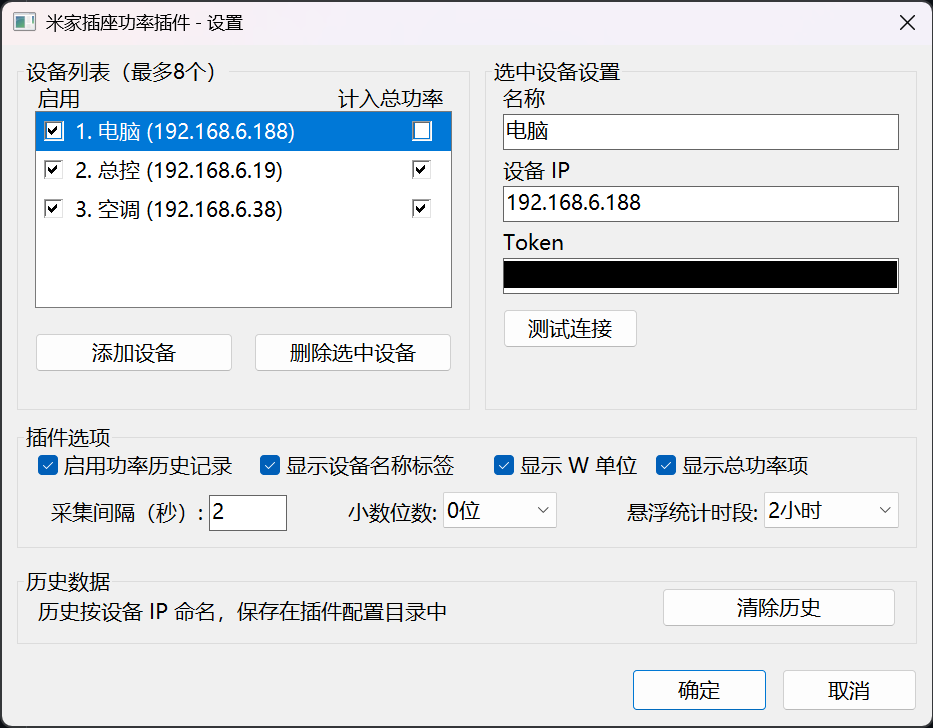

# 米家插座功率 TrafficMonitor 插件

## 简介

这是一个 TrafficMonitor 插件，可以在 Windows 任务栏实时显示米家/酷控（cuco）智能插座的功率数值，并可选开启功率历史记录功能。





**主要功能：**
- 📊 实时在任务栏显示功率（W），**支持多个插座同时显示**（v1.1.0+）
- ➕ 多设备总功率显示项（可勾选哪些插座计入合计，v1.2.0+）
- ⏸️ 每个插座可单独禁用/启用（禁用后不采集连接，v1.2.1+）
- 💾 可选启用功率历史记录（按分钟采样，最多保存7天，每个插座独立记录）
- 📈 鼠标悬停提示：每个插座显示当前功率及 N 小时内最高/最低/平均功率（时段可在设置中调整 1-24 小时，需开启历史记录；TrafficMonitor 重启后统计需重新积累）
- ⚙️ 设置对话框：设备列表增删改、逐个测试连接、调整显示格式
- 🔗 支持断线自动重连

---

## 🚀 快速安装

1. **获取 IP 和 Token** → 使用 [Xiaomi Cloud Tokens Extractor](https://github.com/PiotrMachowski/Xiaomi-cloud-tokens-extractor/releases)
2. **打开插件目录** → TrafficMonitor 右键 → 选项 → 常规设置 → 下滑找到插件管理 → 打开插件目录
3. **放入 DLL** → 将 `MijiaPower.dll` 复制到目录内
4. **重启 TrafficMonitor** → 完全退出后重新启动
5. **填写配置** → 在插件选项中输入 IP 和 Token，点击"测试连接"

---

## 配置说明

### 多设备配置（v1.1.0+）

打开插件设置对话框后：

1. **添加设备** → 点击"添加设备"，最多支持 8 个插座
2. **选中设备** → 在列表中选中要配置的插座
3. **填写信息** → 为选中的插座填写：
   - **名称**：显示在任务栏标签和悬停提示中（如"总控"、"客厅插座"）
   - **设备 IP**：米家插座的局域网 IP 地址
   - **Token**：32位十六进制字符串（获取方法见下方）
4. **行内勾选** → 点击列表行首的复选框切换**启用**（禁用后不采集连接，任务栏显示"已禁用"）；点击行尾的复选框切换**计入总功率**（也可选中后按空格切换启用）
5. **测试连接** → 逐个点击验证每个插座的配置
6. 点击 **确定** 保存

> 💡 **注意**：新增或删除设备后，需要**重启 TrafficMonitor** 才能显示/隐藏对应的任务栏条目（TrafficMonitor 只在启动时枚举插件的显示项）；修改名称、IP、Token 等属性则立即生效。

### 任务栏显示项

每个插座在 TrafficMonitor 的"显示设置"中对应一个独立条目：

| 显示项 | ItemId | 说明 |
|--------|--------|------|
| 米家插座功率(设备名) | `MijiaPwr1`~`MijiaPwr8` | 各插座的实时功率 |
| 米家插座总功率 | `MijiaPwrTotal` | 已勾选"计入总功率"的插座功率合计（2个及以上设备时出现） |

任务栏每个条目的标签为设备名称（如 `总控:196.0W`），可在插件设置中关闭标签。

> ⚠️ **TrafficMonitor 的标签缓存机制**：任务栏窗口会按显示项 ID 在 `config.ini` 的 `[plugin_display_str_taskbar_window]` 中缓存标签文本并在之后覆盖插件提供的实时标签。如果修改了设备名称，任务栏标签要在**重启 TrafficMonitor 后**才会更新；若仍显示旧名称，可在「任务栏窗口设置 → 显示设置」中修改对应条目的标签文本。v1.1.0 及更早版本使用的旧 ID（`MijiaPowerW` 系列）下存在 v1.0 写死的“功率：”缓存，v1.1.1 起已换用新 ID，需在显示设置中重新勾选功率条目。

### 如何获取 Token

#### 🌟 推荐方案：使用 Xiaomi Cloud Tokens Extractor

最便捷和推荐的方法是使用以下项目，它可以自动从米家云提取所有设备的 Token 和 IP：

**项目地址**: [Xiaomi-cloud-tokens-extractor](https://github.com/PiotrMachowski/Xiaomi-cloud-tokens-extractor)

**使用步骤**：

1. **下载工具**
   - 访问 [Release 页面](https://github.com/PiotrMachowski/Xiaomi-cloud-tokens-extractor/releases)
   - 下载最新版本（Windows 用户下载 `.exe` 文件）

2. **运行提取器**
   ```
   点击双击 .exe 文件运行
   或在命令行中：
   xiaomi_cloud_tokens_extractor.exe
   ```

3. **输入米家账户信息**
   ```
   Username: 你的米家账户（邮箱或手机号）
   Password: 你的米家密码
   Server:   China (中国用户选择此项)
   ```

4. **查看结果**
   - 工具会自动列出所有米家设备
   - 复制你的插座设备的 **IP** 和 **Token**
   ```
   设备名称: 客厅插座
   Model:    cuco.plug.v3
   IP:       192.168.1.100
   Token:    a1b2c3d4e5f6a7b8c9d0e1f2a3b4c5d6
   ```

5. **保存信息**
   - 在记事本或文档中保存好 IP 和 Token
   - ⚠️ Token 是敏感信息，请妥善保管，不要分享给他人

#### 📖 其他获取方法

如果上述方法不可用，也可以尝试：

**方法 B - 使用 Python miio 工具**
```bash
# 安装 python-miio
pip install python-miio

# 提取所有设备的 Token
python -m miio.extract_tokens

# 会显示所有设备的信息
```

**方法 C - 使用 MiToolKit**
- 项目地址: [MiToolKit](https://github.com/ultraicy/MiToolKit)
- 下载运行后，选择"提取 Token"功能
- 选择要提取的设备

**方法 D - 米家 APP 抓包提取**
- 使用 Fiddler 或 Charles 代理
- 在米家 APP 中操作设备
- 在代理日志中查找相关请求
- 从 JSON 响应中提取 Token 字段

---

## 📖 使用教程

### 第一步：获取 IP 和 Token

1. 下载 [Xiaomi Cloud Tokens Extractor](https://github.com/PiotrMachowski/Xiaomi-cloud-tokens-extractor/releases)
2. 运行 `.exe` 文件
3. 输入米家账户（邮箱/手机号）和密码，选择 China 服务器
4. 等待提取完成，记录你的插座设备的 **IP** 和 **Token**

### 第二步：安装插件

1. 右键 TrafficMonitor 任务栏 → **选项**
2. 选择 **常规设置** → 下滑找到 **插件管理**
3. 点击 **打开插件目录**
4. 将 `MijiaPower.dll` 复制到打开的目录中
5. **完全关闭 TrafficMonitor**，重新启动

### 第三步：配置插件

1. 重启后，右键 TrafficMonitor → **选项**
2. 左侧菜单选择 **MijiaPowerPlugin**
3. 填写设备信息：
   - **设备 IP**: 从第一步获取
   - **Token**: 从第一步获取  
   - **名称**: 自定义设备名称（如"客厅插座"）
4. 点击 **测试连接** 验证
5. 点击 **确定** 保存

### 配置选项说明

| 选项 | 说明 |
|------|------|
| 启用功率历史记录 | 开启后按分钟采样，每个插座独立保存7天数据 |
| 显示设备名称标签 | 任务栏是否显示设备名称前缀（如"总控:"） |
| 显示总功率项 | 多设备时是否提供"总功率"合计条目（合计范围由设备列表中各行的勾选决定） |
| 显示 W 单位 | 数值后是否显示"W"单位符号 |
| 采集间隔（秒） | 查询设备的时间间隔，建议 3-5 秒（多设备时为轮询所有设备的间隔） |
| 小数位数 | 显示精度：0=整数，1=一位小数，2=两位小数 |
| 悬浮统计时段 | 悬停提示中"最高/最低/平均"统计的时间窗口（1/2/3/6/12/24 小时） |

---

## 📖 详细使用教程

### 安装前检查清单

- ✅ TrafficMonitor 已安装（v1.74 或更高版本）
- ✅ 米家账户可正常登录
- ✅ 智能插座已添加到米家 APP
- ✅ 智能插座与电脑在同一局域网

### 完整安装和配置步骤

#### 第一步：获取设备 IP 和 Token

1. 下载 [Xiaomi Cloud Tokens Extractor](https://github.com/PiotrMachowski/Xiaomi-cloud-tokens-extractor/releases)

2. 运行 `.exe` 文件

3. 输入米家账户信息：
   ```
   Username: 你的米家账号（邮箱/手机号）
   Password: 你的米家密码
   Server:   China
   ```

4. 等待提取完成，找到你的插座设备：
   ```
   设备: 客厅插座
   IP: 192.168.1.100
   Token: a1b2c3d4e5f6a7b8c9d0e1f2a3b4c5d6
   ```

5. 用记事本记录下 **IP** 和 **Token**

#### 第二步：安装插件 DLL

1. **找到 TrafficMonitor 目录**
   - 通常在：`C:\Program Files\TrafficMonitor\`
   - 或右键 TrafficMonitor 快捷方式 → 打开文件位置

2. **创建 plugins 文件夹**（如果不存在）
   ```
   C:\Program Files\TrafficMonitor\plugins\
   ```

3. **放入 DLL 文件**
   - 将 `MijiaPower.dll` 复制到 `plugins` 文件夹

4. **完全关闭 TrafficMonitor**
   - 右键任务栏图标 → 退出

5. **重新启动 TrafficMonitor**

#### 第三步：配置插件

1. **打开插件选项**
   - 右键 TrafficMonitor 任务栏区域 → 选项
   - 或左侧菜单 → MijiaPowerPlugin → 选项

2. **填写设备信息**
   ```
   设备 IP:  192.168.1.100    (从第一步获取)
   Token:    a1b2c3d4...      (从第一步获取)
   名称:     客厅插座          (可选，自定义名称)
   ```

3. **点击"测试连接"验证**
   - 若显示连接成功 ✅ → 配置正确
   - 若显示连接失败 ❌ → 重新检查 IP 和 Token

4. **点击"确定"保存**

#### 第四步：开始使用

- 插件会立即显示实时功率
- 任务栏中显示为 `设备名: XX.X W`（如 `客厅插座: 196.0 W`，可在设置中关闭名称）
- 鼠标悬停会显示每台设备的当前功率及"N 小时内最高/最低/平均"统计（需开启历史记录）
- 多设备时可在"显示设置"中勾选"米家插座总功率"条目查看合计

### 常见问题快速解决

| 问题 | 症状 | 解决方案 |
|------|------|---------|
| 连接失败 | 显示"连接失败" | 检查 IP 和 Token 是否正确 |
| 没有显示 | 看不到功率数值 | 确认 DLL 文件在 plugins 目录中 |
| 数据异常 | 显示 0W 或错误值 | 检查设备是否开启，重启插件 |
| Token 失败 | 工具无法提取 | 确保米家账户密码正确，网络正常 |

### 高级配置选项

安装完成后，可以在插件选项中调整：

| 选项 | 默认值 | 推荐值 | 说明 |
|------|--------|--------|------|
| 启用历史记录 | 开启 | 开启 | 按分钟采样记录功率数据用于分析 |
| 显示设备名称标签 | 开启 | 开启 | 任务栏显示设备名前缀（如"客厅插座:"） |
| 显示总功率项 | 开启 | 开启 | 多设备时提供"总功率"合计条目（2个及以上设备时出现） |
| 显示 W 单位 | 开启 | 开启 | 数值后显示"W" |
| 采集间隔(秒) | 3 | 3-5 | 越小更新越快，但消耗更多资源 |
| 小数位数 | 1 | 1 | 显示精度（0-2位） |
| 悬浮统计时段 | 1 小时 | 按需 | 悬停提示统计窗口（1/2/3/6/12/24 小时） |

---

## 文件说明

| 文件 | 说明 |
|------|------|
| `PluginInterface.h` | TrafficMonitor 插件接口定义 |
| `MiioDevice.h/.cpp` | 纯C++ miIO协议实现（AES-128-CBC + UDP） |
| `PowerHistory.h/.cpp` | 功率历史采样与统计 |
| `PluginConfig.h/.cpp` | 插件配置（INI文件读写） |
| `MijiaPowerPlugin.h/.cpp` | 插件主类（ITMPlugin/IPluginItem实现） |
| `OptionsDlg.h/.cpp` | 设置对话框（纯Win32） |
| `pch.h/.cpp` | 预编译头 |

---

## 配置文件位置

插件配置文件默认保存在 TrafficMonitor 的插件配置目录：
```
<插件配置目录>\
  MijiaPower.ini                    ← 设备信息和选项
  MijiaPower_history_<IP>.json      ← 各插座的功率历史（按设备 IP 命名，如果启用）
```

历史文件按**设备身份（IP）**命名，在设置对话框中删除或调整设备顺序后，各插座的历史数据仍与设备一一对应，不会错位。

> 💡 **历史文件自动迁移**：首次加载时，v1.1.0/1.1.1 按索引命名的 `MijiaPower_history_N.json` 会自动迁移为对应设备的按 IP 命名文件，v1.0 的 `MijiaPower_history.json` 会迁移为第 1 个设备的历史文件（均为目标不存在才迁移，可重复执行，无需手动修改）。

> 💡 **从 v1.0 升级**：旧版单设备配置（`[Device]` 段）会被自动读取为第 1 个设备，无需手动修改。

### MijiaPower.ini 格式（v1.1.0 多设备）

```ini
[Plugin]
DeviceCount=3
EnableRecording=1
ShowLabel=1
ShowTotal=1
ShowUnit=1
UpdateIntervalSec=3
DecimalPlaces=1
TooltipStatsHours=1

[Device1]
IP=192.168.1.100
Token=2f5a8c1e9b3d47a6b0c8d2e4f6a8b0c2
Name=客厅插座
InTotal=1
Enabled=1

[Device2]
IP=192.168.1.101
Token=a1b2c3d4e5f6a7b8c9d0e1f2a3b4c5d6
Name=书房插座
InTotal=0
Enabled=0

[Device3]
IP=192.168.1.102
Token=00112233445566778899aabbccddeeff
Name=卧室插座
InTotal=1
Enabled=1
```

> 💡 `InTotal` 表示该插座是否计入"总功率"合计（v1.2.0+）；`Enabled` 表示是否启用该插座（v1.2.1+，禁用后不采集连接）。两者缺省均视为 1。`TooltipStatsHours` 为悬停提示统计窗口小时数（v1.2.2+，缺省 1）。

> 💡 **从 v1.0 升级**：旧版单设备配置（`[Device]` 段）会被自动读取为 `[Device1]`，历史文件会自动迁移（见上文"历史文件自动迁移"），无需手动修改。

---

## 注意事项

1. 插件通过 UDP 协议（端口 54321）直接与设备通信，**设备必须与电脑在同一局域网**
2. miIO 协议需要正确的 Token，错误的 Token 会导致连接失败
3. 采集间隔不建议设置低于 2 秒，以免对设备造成过多请求
4. 如果设备固件不支持 `siid=11,piid=2`（功率属性），请联系插件作者

---

## 兼容的设备

基于原项目 `mijia_plug` 的设备属性定义：

| 属性 | siid | piid | 说明 |
|------|------|------|------|
| 开关 | 2 | 1 | 插座开关状态 |
| 功率 | 11 | 2 | 当前功率（W） |
| 能耗 | 11 | 1 | 累计用电量 |
| 温度 | 12 | 2 | 插座温度 |

已知兼容型号：`cuco.plug.v3`（米家智能插座3）

---

## 开发依赖

插件完全无第三方依赖，所有加密算法（AES-128-CBC、MD5）均为纯 C++ 实现，仅依赖 Windows 系统 API（ws2_32.lib、comctl32.lib）。

## 编译

- **Visual Studio**：打开 `MijiaPowerPlugin.sln` 编译 Release|x64（或运行 `compile.ps1`）
- **MinGW (GCC)**：运行 `bash build_gcc.sh`（生成静态链接的 x64 DLL，无需运行时依赖）

## 更新日志

### v1.2.4
- 🖥️ **修复混合 DPI 多屏下设置窗口显示错乱的问题**：宿主（TrafficMonitor）为 PerMonitorV2 DPI 感知进程时，把设置窗口从高缩放屏幕（如 4K 150%）拖到 100% 缩放屏幕，窗口外框被系统按比例缩小而内部控件仍保持原缩放，右列与底部被裁掉。现在收到 `WM_DPICHANGED` 后重建字体并按设计坐标全量重排子控件，任意 DPI 下比例一致
- 🎨 插件选项区改为对齐网格布局：四个复选框一行等距分布，"采集间隔 / 小数位数 / 悬浮统计时段"三组标签右对齐、值控件同一基线
- 🎨 设备列表加高（可多显示约一行），减少滚动
- 🔖 版本号更新为 1.2.4

### v1.2.3
- 🖥️ **修复高缩放屏幕（如 1080p/4K 开 125%~200% 缩放）下设置窗口显示过小的问题**：设置对话框改为按所在显示器的 DPI 整体等比缩放——窗口尺寸、字体、设备列表行高与行内复选框热区同步放大，100% 缩放下与旧版逐像素一致
- 🖥️ 设置窗口打开位置改为按父窗口所在显示器居中，并整体夹入该显示器工作区，多显示器/工作区边缘不再出现窗口被裁切
- 🔖 版本号更新为 1.2.3

### v1.2.2
- ✨ **悬停提示统计增强**：每台设备改为显示"N 小时内 最高/最低/平均"功率（原 24h 平均删除），N 可在插件选项"悬浮统计时段"中选择（1/2/3/6/12/24 小时），持久化为 `[Plugin] TooltipStatsHours`（缺省 1）
- 🔖 版本号更新为 1.2.2

### v1.2.1
- ✨ **每插座可单独禁用**：设备列表行首新增"启用"复选框，禁用后停止采集与连接，任务栏数值显示"已禁用"，悬停提示相应标注；配置持久化为 `[DeviceN] Enabled`，旧配置缺省视为启用
- 🎨 设备列表行高加大，修复行文字底部被裁切的问题；列表上方增加"启用 / 计入总功率"列头说明
- 🐛 "测试连接"状态文字改为单行省略号并独占按钮下方通栏一行，修复长提示被截断/遮挡的问题
- 🔖 版本号更新为 1.2.1

### v1.2.0
- ✨ **总功率可自定义合计范围**：设置对话框设备列表每行新增复选框"计入总功率"，只有勾选的插座才会计入总功率项与悬停提示合计行（此前固定合计全部已连接设备）；配置持久化为 `[DeviceN] InTotal`，旧配置缺省视为计入
- 🎨 设置界面布局重排：设备列表（左）与选中设备设置（右）左右分区，下方为插件选项与历史数据，窗口更紧凑
- 🔖 版本号更新为 1.2.0

### v1.1.5
- 🛡️ **悬浮提示瘦身**：TM 将所有插件的 tooltip 拼成一条传给 MFC `CToolTipCtrl::UpdateTipText`，超过 1024 字符会抛 `CInvalidArgException`，宿主弹"遇到不适当的参数。"错误框。本插件原样式每插座 15 行（3 插座即 700+ 字符），与其他信息型插件同载时总长越界触发弹框。现改为每插座一行（当前功率 + 24h 均值）+ 合计行，总长护栏 400 字符；完整统计仍在设置窗口查看
- 🔖 版本号更新为 1.1.5

### v1.1.4
- 🔒 移除 README 示例配置中的真实设备 Token 与局域网 IP，示例改为虚构值（注意：该 Token 已存在于公开的 git 历史中，miIO Token 仅同一局域网内可用，实际风险低；介意者可在米家 App 中重新配网轮换）
- 🖼️ 设置对话框截图改用虚构设备数据重拍（原图含真实设备名与 IP）
- 🐛 设置界面历史文件说明文字精简为单行完整显示（此前仍会被省略号截断）
- 🛡️ 加载功率历史文件增加 4M 字符读取上限，防御异常膨胀的文件

### v1.1.3
- 🐛 设置界面历史文件说明更正为按 IP 命名（`MijiaPower_history_<IP>.json`），此前仍写旧索引命名
- 🐛 "清除历史"改为按 `MijiaPower_history*.json` 模式删除，同时清掉已移除设备遗留的历史文件
- 🔒 保存配置时清理 v1.0 遗留的 `[Device]` 段（旧 Token 不再残留明文）
- ⌨️ 设置对话框控件补齐 `WS_TABSTOP`，Tab 键导航可用
- 🔧 配置变更时历史文件的加载/保存移出设备列表锁，不再短暂拖慢采样线程
- 🐛 Token 格式非法时任务栏显示"未配置"，不再永远停留在"连接中..."
- 🔒 AES 解密校验 PKCS7 填充一致性，填充异常视为数据损坏
- 🧹 清理 `MiioDevice.h` 无引用结构体与 `OptionsDlg.h` 残留声明；`test_dialog` 增加 GetProcAddress 空指针检查

### v1.1.2
- 🐛 修复功率历史在 TrafficMonitor 正常退出时不保存的问题：改为主线程每 60 秒周期性落盘（最坏丢失 1 分钟数据）
- 🐛 修复"清除历史"后内存数据未清空、稍后被采样线程写回文件的问题
- 🔧 历史文件改为按设备 IP 命名（`MijiaPower_history_<IP>.json`），删除/重排设备后历史不再错位；旧命名文件自动迁移
- 🐛 修复设备离线较多时点击"确定"可能卡住界面（每台设备最长约 10 秒）的问题：网络操作不再与主线程争抢设备锁
- 🔒 miIO 通信加固：UDP connect 过滤伪造来源，校验应答魔数/设备 ID/checksum
- 🐛 修复部分固件把功率返回为字符串（`"value":"23.4"`）时解析失败、无限重连的问题
- 🔒 Token 增加 32 位十六进制格式校验，设置界面给出明确提示，非法 Token 不再静默尝试连接
- 🔧 配置对象读写加锁（UI 线程写 / 采集线程读），消除数据竞争
- 🔧 兼容回退的配置目录优先取自主程序接口（`ITrafficMonitor::GetPluginConfigDir`），不再退回进程当前目录
- 🔧 实时缓冲扩到 600 条（1 秒采集间隔下"最近10分钟"统计完整）；清理死代码与 GDI 字体泄漏

### v1.1.1
- 🔧 更换显示项 ID（`MijiaPwr1`~`MijiaPwr8` / `MijiaPwrTotal`）：TrafficMonitor 会按 ID 缓存任务栏标签文本，旧 ID 下存在 v1.0 写死的“功率：”缓存导致设备名不生效（需在显示设置重新勾选条目）
- 🔧 设置对话框恢复紧凑固定尺寸，修复高 DPI 环境下窗口过大、控件重叠/裁切问题
- ✨ 悬浮提示恢复 v1.0 详细统计样式（每插座 10分钟/1小时/24小时 最大/最小/平均 + 合计）
- 🐛 修复 MinGW 编译下宽字符 `%s` 打印乱码的问题
- ➕ 新增 MinGW 构建脚本 `build_gcc.sh`（静态链接）与插件测试宿主 `test_harness`/`test_dialog`

### v1.1.0
- ✨ 支持多个米家插座同时显示（最多 8 个），每个插座独立显示项
- ✨ 新增"总功率"显示项（所有已连接插座功率合计）
- ✨ 设置对话框改为设备列表模式，支持添加/删除/逐个测试连接
- ✨ 每个插座独立的功率历史记录与断线重连
- 🔧 兼容 v1.0 单设备配置，自动迁移
